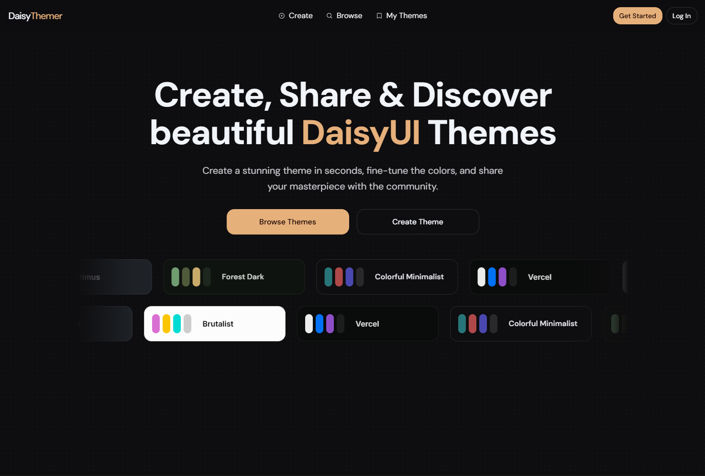

# Themes DaisyUI

A beautiful web application designed for creating, exploring, and sharing your own custom DaisyUI themes.

### About the Project
Themes DaisyUI provides a platform for developers and designers to showcase their creativity. You can build UI themes using our intuitive visual builder and share them with the community.

### Key Highlights
**Visual Theme Builder**
Build your own DaisyUI themes directly in the browser with an interactive visual editor.

**Community Explorer**
Discover new styles, browse community creations, and easily apply them to your own applications.

### Technology Stack
This platform is built with modern web technologies to ensure a fast and delightful user experience. 

It uses **React** and **TanStack Start** for a robust frontend architecture, elegantly styled with **Tailwind CSS v4** and **DaisyUI v5**. Smooth interactions are powered by **Motion Primitives**, while data and state are managed by **Zustand** and **TanStack Query**. Navigation is handled by **TanStack Router**, and everything is backed securely by **Supabase**.

Made with ❤️ for the DaisyUI community.

